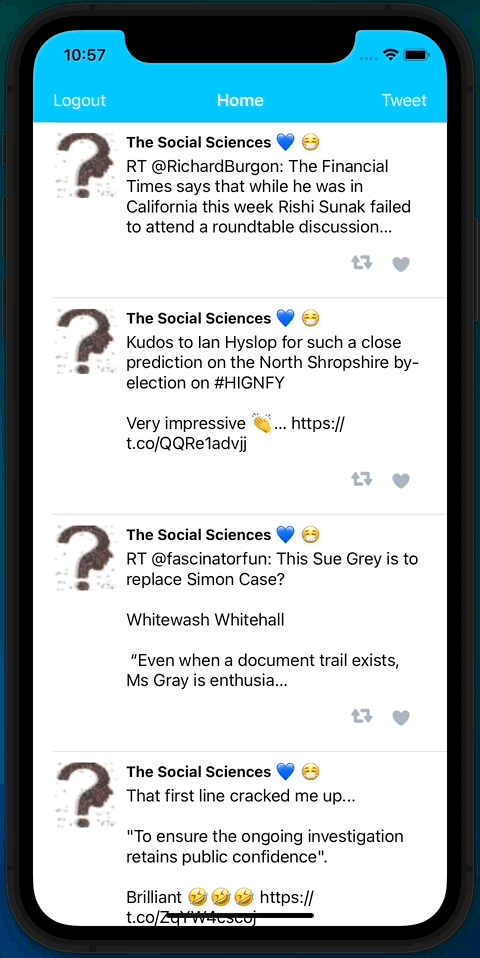

# Twitter

This is a basic twitter app to view, compose, favorite, and retweet tweets.

## User Stories

- [x] User can compose a tweet. 
- [x] User can favorite a tweet.
- [x] User can retweet a tweet. 

## Video Walkthrough

Here's a walkthrough of implemented user stories:

# Project 3 - *Tweety*

**Tweety** is a basic twitter app to read your tweets.

## User Stories

The following functionality is completed:

- [x] User sees app icon in home screen and styled launch screen.
- [x] User can log in. 
- [x] User can log out. 
- [x] User stays logged in across restarts. 
- [x] User can view tweets with the user profile picture, username, and tweet text.
- [x] User can pull to refresh. (1pt)
- [x] User can load past tweets infinitely. (2pts)

## Video Walkthrough

Here's a walkthrough of implemented user stories:

